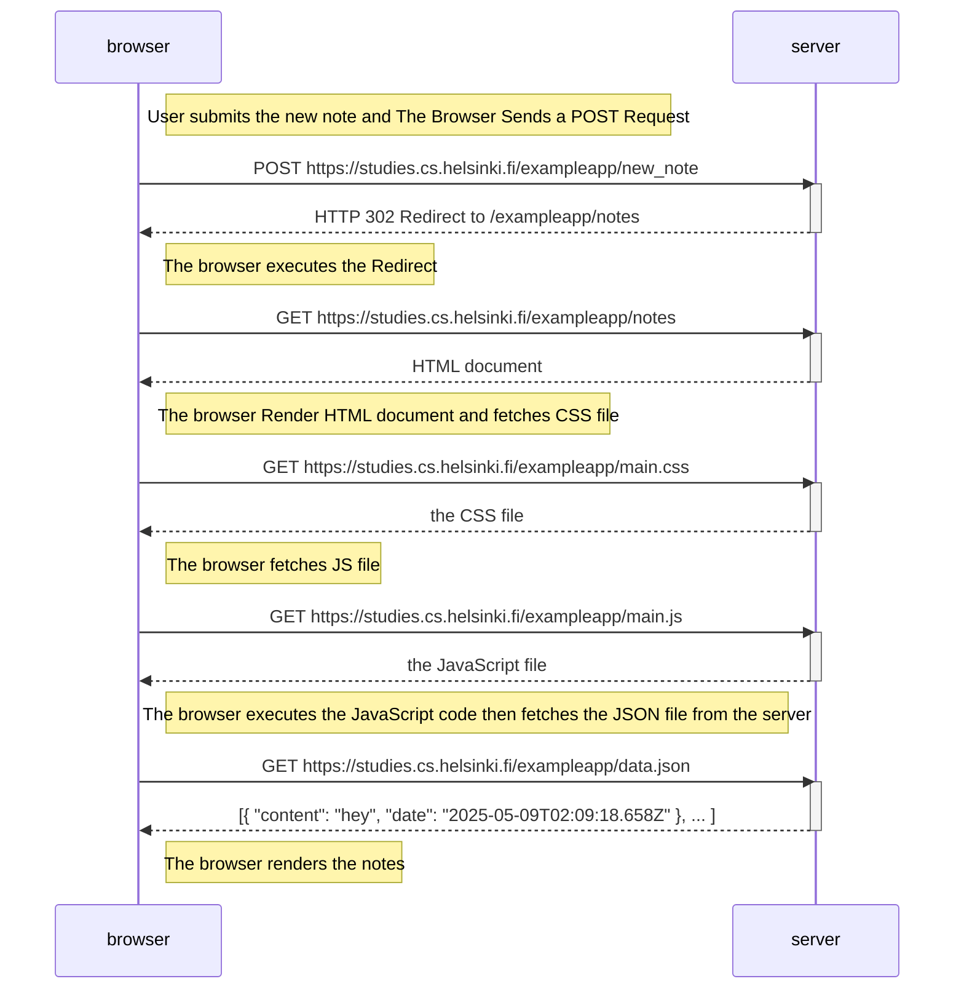

### New Note Sequence Diagram

```mermaid
sequenceDiagram
    participant browser
    participant server

    Note right of browser: User submits the new note and The Browser Sends a POST Request

    browser->>server: POST https://studies.cs.helsinki.fi/exampleapp/new_note
    activate server
    server-->>browser: HTTP 302 Redirect to /exampleapp/notes
    deactivate server

    Note right of browser: The browser executes the Redirect

    browser->>server: GET https://studies.cs.helsinki.fi/exampleapp/notes
    activate server
    server-->>browser: HTML document
    deactivate server

    Note right of browser: The browser Render HTML document and fetches CSS file

    browser->>server: GET https://studies.cs.helsinki.fi/exampleapp/main.css
    activate server
    server-->>browser: the CSS file
    deactivate server

    Note right of browser: The browser fetches JS file

    browser->>server: GET https://studies.cs.helsinki.fi/exampleapp/main.js
    activate server
    server-->>browser: the JavaScript file
    deactivate server

    Note right of browser: The browser executes the JavaScript code then fetches the JSON file from the server

    browser->>server: GET https://studies.cs.helsinki.fi/exampleapp/data.json
    activate server
    server-->>browser: [{ "content": "hey", "date": "2025-05-09T02:09:18.658Z" }, ... ]
    deactivate server

    Note right of browser: The browser renders the notes
```
