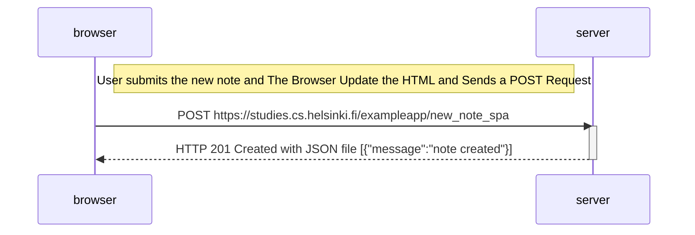

### Single Page Application New Note Sequence Diagram

```mermaid
sequenceDiagram
    participant browser
    participant server

    Note right of browser: User submits the new note and The Browser Update the HTML and Sends a POST Request

    browser->>server: POST https://studies.cs.helsinki.fi/exampleapp/new_note_spa
    activate server
    server-->>browser: HTTP 201 Created with JSON file [{"message":"note created"}]
    deactivate server

```